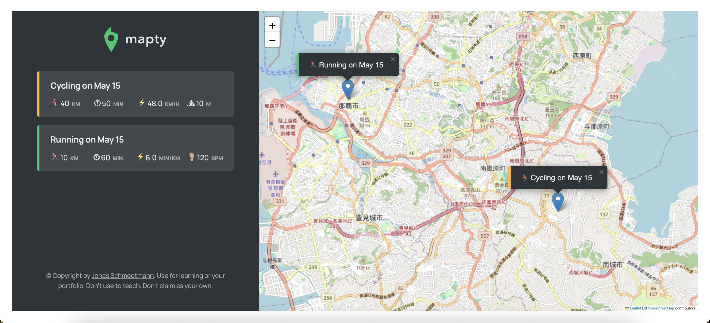

# Mapty

This is a exercise from 'The Complete JavaScript Course 2024'.
User can log their running & cycling workouts with location.
User can see all of their workouts list.
User can see their workouts on a map.
The datas save in the local storage.

- Screenshot:
  

- Live URL: https://yacodingroom.github.io/mapty/

## Built with

- HTML
- CSS
- JavaScript

To learn React, check out the [React documentation](https://reactjs.org/).

## Author

- The Complete JavaScript Course 2024 by Jonas Schmedtmann
- YAL
